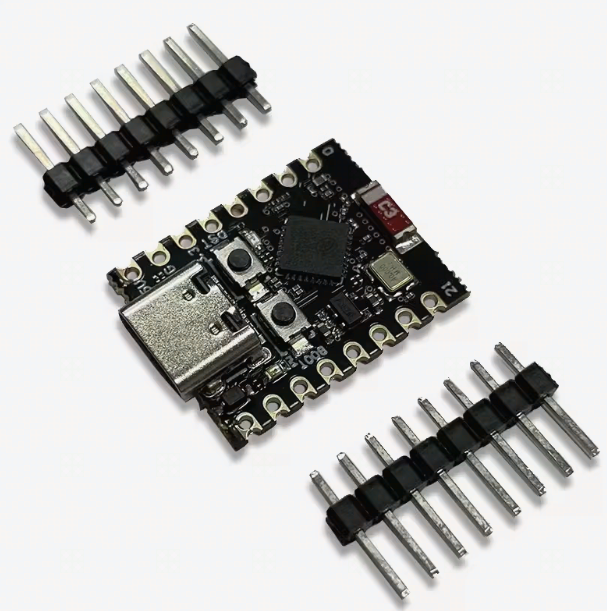
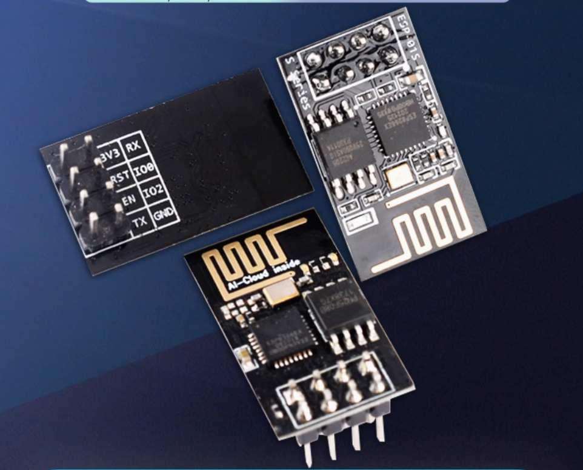
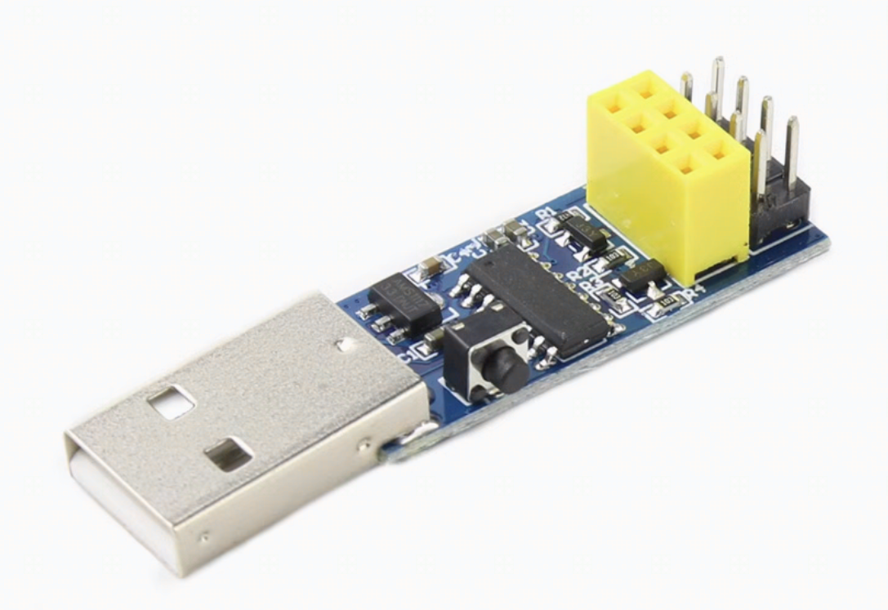

# 🔧 EspNow-Feeder 项目文档

[](https://platformio.org/)
[](https://www.espressif.com/)
[](https://www.espressif.com/)
[](LICENSE)

> 🚀 基于ESP-NOW协议的无线Pick and Place系统喂料器解决方案

## 0. 前前言
项目还在更新中，可能涉及部分工程文件（3D模型 软件代码）变动。

项目主要是个人折腾，不想所有的 Feeder 都要连接到主控板 Arduino Mega， 希望使用便宜的ESP01s来控制每个 Feeder，每个Feeder 通过 ESP01s 去和 中央控制单元 ("Brain")通信，中央控制单元 ("Brain")通过串口和上位机 OPenpnp进行通信，接收Gcode处理相对应的指令。

## 1. 前言
本人非软件工程专业，属于业余开发者。本项目的主要代码由 AI 辅助编写，我负责提供整体架构设计和思路。
如果你想快速实现便宜的 Feeder 投入到  Lumenpnp 中使用，你可以使用 [MaxFeeder](https://github.com/RinthLabs/MaxFeeder) 项目直接快速的构建 Feeder。

### 🛠️ 复制本项目所需技能

#### 基础技能要求
- 📟 **基本的编译烧录经验** `⭐⭐⭐`
  - 熟悉 Arduino IDE 或 PlatformIO 开发环境
  - 了解ESP32/ESP8266的基本烧录流程
  - 具备基础的串口调试能力
  - 预计学习时间：1-2天（如果完全没有经验）

- 🖨️ **3D 打印经验** `⭐⭐`
  - 能够操作3D打印机（FDM即可）
  - 了解基本的3D打印参数设置（层高0.2mm，填充20%即可）
  - 具备简单的后处理能力（去支撑、打磨等）
  - 预计打印时间：每个喂料器约2-4小时

- 🔧 **基础硬件连接** `⭐⭐`
  - 能够识别和连接杜邦线、排针等基础元件
  - 理解串口通信概念（TX、RX、GND、VCC）
  - 掌握基本的电压概念（3.3V/5V区别）
  - 能够使用万用表进行基础测量（可选但推荐）

- 📖 **配置文件修改能力** `⭐`
  - 能够使用文本编辑器修改`.h`配置文件
  - 理解基本的`#define`宏定义概念
  - 能够按说明修改参数值（如Feeder ID、引脚定义等）

#### 可选技能（加分项）
- 🔧 **电子制作进阶** `⭐⭐` - 焊接、制作杜邦线、PCB组装等
- 📐 **CAD软件使用** `⭐⭐` - 如需修改3D模型（支持STEP格式）
- 🤖 **PnP设备使用经验** `⭐⭐⭐` - OpenPnP等软件使用经验
- 📡 **无线通信调试** `⭐⭐` - ESP-NOW协议理解、WiFi信道概念
- 🧠 **嵌入式调试** `⭐⭐⭐` - 串口监视器使用、日志分析能力

#### 💰 预算参考
- **最小配置**（1个Brain + 1个Hand）：约 ¥50-80
- **完整系统**（1个Brain + 多个Hand）：约 ¥30-50/每个额外Hand
- **3D打印材料**：约 ¥5-10/每个喂料器
- **舵机等配件**：约 ¥15-25/每个喂料器

> 💡 **新手提示**：即使没有以上技能，跟随本文档的详细步骤也能成功完成项目！建议先从1个Brain+1个Hand的最小系统开始学习。

## 2. 项目概述

🎯 **ESPNOW-PNP** 是一个基于 ESP-NOW 无线通信协议的 Pick and Place (PNP) 系统组件。该系统主要由一个中央控制单元 ("Brain") 和多个执行单元 ("Hand") 组成：

- 🧠 **Brain 单元**: 负责接收上层指令 (如 G-code)，管理并调度 "Hand" 单元执行物料拾取和放置相关的喂料动作
- 🤖 **Hand 单元**: 直接控制伺服电机等执行机构完成具体的喂料操作

### 🔍 项目特点
- ✅ 无线通信，减少布线复杂度
- ✅ 低成本ESP模块，性价比高
- ✅ 模块化设计，易于扩展
- ✅ 兼容OpenPnP等主流PnP软件

本项目借鉴了 [MaxFeeder](https://github.com/RinthLabs/MaxFeeder) 项目的许多代码和设计思想。

## 3. 🎨 3D模型和PCB
本项目重新设计了PCB文件，用于安装 ESP01s 到Feeder上，具体可以查看 `3D/` 文件夹。

### 📁 可用文件
- 🔧 **max-feeder-8mm-fix.stl** - 8mm规格喂料器3D模型
- 🔧 **max-feeder-12mm-修改版.stl** - 12mm规格喂料器3D模型  
- 📐 **STEP格式文件** - 可编辑的原始设计文件

## 4. 🛒 需要耗材

### 4.1 ESP32C3 SuperMini
ESP32C3 SuperMini 是淘宝上很便宜的C3 模组，用作Brain单元。



⚠️ **注意事项**：
- 使用ESP32C3 需要安装 FTDI 驱动
- 如果插上电脑不显示Com口，显示 "JTAG/serial debug unit"，请参考：
  - [ESP32C3 SuperMini 驱动问题解决](https://www.nologo.tech/product/esp32/esp32c3/esp32c3supermini/esp32C3SuperMini.html#q3-%E6%8F%92%E4%B8%8A%E7%94%B5%E8%84%91%E4%B8%8D%E6%98%BE%E7%A4%BAcom%E5%8F%A3-%E6%98%BE%E7%A4%BA-jtag-serial-debug-unit)
  - [使用Arduino给ESP32C3/S2/S3开发板下载程序](https://chat.nologo.tech/d/72/2)

### 4.2 ESP01S 模块
ESP01S 模块用作Hand单元，控制各个Feeder。**注意：记得买01s而不是01**



### 4.3 ESP01S 烧录器
你还需要一个烧录程序的座子来对ESP01S进行编程，可以在淘宝选购。



**购买链接**：[固件下载器ESP-01烧录器](https://item.taobao.com/item.htm?abbucket=8&detail_redpacket_pop=true&id=646972167777&ltk2=1749533731880gkpjj05gxfptt2limj1ub&ns=1&priceTId=undefined&query=esp01s&skuId=4655609620303&spm=a21n57.1.hoverItem.12&utparam=%7B%22aplus_abtest%22%3A%22c8cbd779e89c62d188297ae29ec1e5d1%22%7D&xxc=taobaoSearch)

## 5. 系统架构与技术详解
如需了解详细的系统架构、通信协议、各模块逻辑和配置说明，请参阅：

**📖 [系统架构与技术详解](Docs/系统架构与技术详解.md)**

该文档包含以下详细内容：
- 系统架构和核心组件
- ESP-NOW 通信协议详解
- Brain 单元逻辑实现
- Hand 单元逻辑实现  
- 配置文件说明
- G-Code/M-Code 指令规范

## 6. 目录结构
*   `src/`: 核心源代码。
    *   `brain/`: Brain (ESP32C3) 代码。
    *   `hand/`: Hand (ESP01S) 代码。
    *   `common/`: Brain 和 Hand 共用代码 (如协议定义)。
*   `Docs/`: 项目文档。
    *   `img/`: 文档相关图片资源。
*   `3D/`: 3D模型文件。
*   `tools/`: 开发工具和脚本。
*   `lib/`, `include/`: 库和头文件。
*   `test/`: 测试脚本和代码。
*   `demo/`: 示例或参考代码 (其中 `0816feeder` 是一个功能更复杂的独立喂料器项目，与当前 ESPNOW-PNP 架构不完全相同)。
*   `platformio.ini`: PlatformIO 配置文件。

## 7. 如何使用本项目

### 7.1 开发环境准备

#### 安装 PlatformIO
1. **安装 Visual Studio Code**
   - 从 [官网](https://code.visualstudio.com/) 下载并安装 VS Code

2. **安装 PlatformIO 扩展**
   - 打开 VS Code
   - 进入扩展市场 (Ctrl+Shift+X 或 Cmd+Shift+X)
   - 搜索 "PlatformIO IDE" 并安装
   - 重启 VS Code

3. **验证安装**
   - VS Code 左侧应出现 PlatformIO 图标
   - 底部状态栏应显示 PlatformIO 相关按钮

### 7.2 项目编译与上传

#### 克隆项目
```bash
git clone https://github.com/your-username/ESPNOW-PNP.git
cd ESPNOW-PNP
```

#### 打开项目
1. 在 VS Code 中打开项目文件夹
2. PlatformIO 会自动检测 `platformio.ini` 配置文件
3. 等待依赖库自动下载完成

#### 编译和上传

**Brain 单元 (ESP32C3):**
```bash
# 编译 Brain 固件
pio run -e esp32c3-brain

# 上传到 ESP32C3 开发板
pio run -e esp32c3-brain -t upload

# 监控串口输出
pio device monitor -e esp32c3-brain
```

**Hand 单元 (ESP01S):**
```bash
# 编译 Hand 固件
pio run -e esp01s-hand

# 上传到 ESP01S 模块
pio run -e esp01s-hand -t upload

# 监控串口输出
pio device monitor -e esp01s-hand
```

### 7.3 硬件连接

#### Brain 单元 (ESP32C3)
- **串口连接**: USB 转串口模块连接到电脑
- **LCD 显示**: I2C LCD1602 连接到 SDA/SCL 引脚
- **电源**: 5V/3.3V 供电

#### Hand 单元 (ESP01S)
- **舵机连接**: 根据 `hand_config.h` 中的 `SERVO_PIN` 设置
- **电源**: 3.3V 供电 (注意电流需求)
- **编程**: 需要 ESP01S 编程器或适配板

### 7.4 配置说明

#### 配置 Feeder ID
每个 Hand 单元需要唯一的 Feeder ID：

1. **方法一**: 修改 `src/hand/hand_config.h` 中的 `FEEDER_ID`
```cpp
#define FEEDER_ID 1  // 修改为唯一ID (1-32)
```

2. **方法二**: 通过串口命令设置
```
SET_ID:5    // 设置 Feeder ID 为 5
GET_ID      // 查询当前 Feeder ID
```

#### 调整超时参数
在 `src/brain/brain_config.h` 中调整通信参数：
```cpp
#define COMMAND_TIMEOUT_MS 5000      // 命令超时时间
#define HEARTBEAT_INTERVAL_MS 10000  // 心跳间隔
#define HAND_OFFLINE_TIMEOUT_MS 30000 // Hand 离线判定时间
```

### 7.5 测试验证

#### 基本功能测试
1. **Brain 启动**: LCD 应显示启动信息和在线 Hand 数量
2. **Hand 注册**: Hand 上电后会自动向 Brain 注册
3. **心跳检测**: Brain 会定期发送心跳包检测 Hand 状态

#### G-Code 命令测试
通过串口工具向 Brain 发送命令：
```gcode
M600 N1 F10    ; 命令 Feeder ID=1 推进 10mm
M610 S1        ; 启用所有喂料器
M610 S0        ; 禁用所有喂料器
M610           ; 查询喂料器状态
```

### 7.6 故障排除

#### 常见问题
1. **编译错误**: 确保安装了所有依赖库
2. **上传失败**: 检查串口权限和波特率设置
3. **ESP-NOW 通信失败**: 确认两个设备在同一 WiFi 信道
4. **Hand 无法注册**: 检查 Feeder ID 是否冲突

#### 调试技巧
- 启用串口调试输出查看详细日志
- 使用 PlatformIO 的串口监视器实时查看输出
- 检查硬件连接和电源供应

## 8. 进一步分析和注意事项
*   **Hand 注册**: `CMD_HAND_REGISTER` 协议已定义，但具体实现流程需进一步确认。
*   **MAC 地址管理**: 依赖 Hand 响应心跳来动态管理
*   **G-code 完整性**: `gcode.cpp` 中部分 M-code 的实现可能与测试脚本或 `gcode.h` 定义存在差异，需确认最终支持的指令集。

## 9. 免责声明
本项目按“原样”提供，不作任何明示或暗示的保证，包括但不限于对适销性、特定用途适用性和非侵权性的保证。在任何情况下，作者或版权持有人均不对任何索赔、损害或其他责任承担任何责任，无论是在合同诉讼、侵权行为还是其他方面，由软件或软件的使用或其他交易引起、产生或与之相关的。
### 您可以自由更改源代码以满足您的需求，但请注意，修改后的代码可能不受原始作者的支持。
### 请自行承担使用风险。

## 10. 贡献
欢迎对此项目做出贡献！如果您有任何改进建议、错误修复或新功能，请随时创建 Pull Request 或提交 Issue。

我们鼓励社区参与，并感谢所有帮助改进此项目的贡献者。
